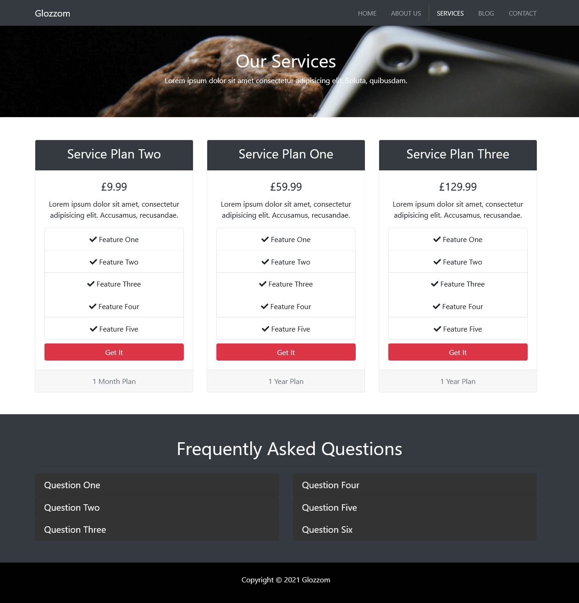

# Glozzom

## Table of contents

- [Overview](#overview)
  - [The challenge](#the-challenge)
  - [Links](#links)
  - [Screenshot](#screenshot)
- [My process](#my-process)
  - [Built with](#built-with)
- [Author](#author)

## Overview

Users should be able to:

- Go through the four-pages website design
- View the optimal layout for the app depending on their device's screen size
- See hover states for all interactive elements on the page

### Links

- GitHub URL: [https://github.com/Nesh00/glozzom]
- Live Site URL: [https://glozzom-nenad.netlify.app/]

### Screenshot

## My process

### Built with

- Semantic HTML5 markup
- Bootstrap 4
- Responsive Design
- Mobile-first workflow

## Author

- Nenad Tsvetanovski
- LinkedIn - [https://www.linkedin.com/in/nenad-tsvetanovski-3101b474/]
- Twitter - [https://twitter.com/nenad37452460]
